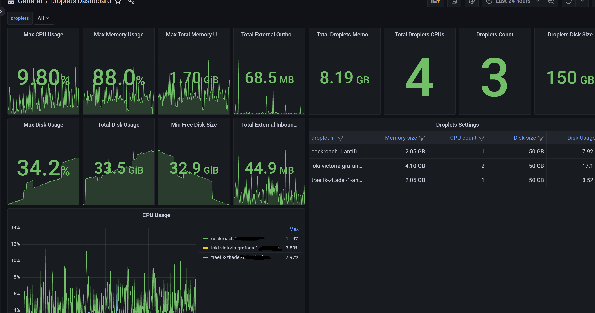
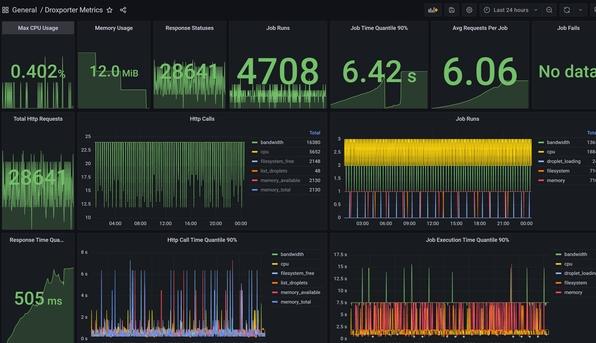

# Droxporter

Droxporter is a Prometheus exporter for DigitalOcean Droplets.
It collects various metrics and exposes them in a format compatible with Prometheus.
The main features of Droxporter include:

* Lightweight and efficient. Written entirely in Rust.
* Collecting Droplet-related metrics, such as CPU usage, memory usage, disk space, bandwidth, and more.
* Support for HTTPS, basic authentication, and custom settings.
* Built-in rate limiting to respect DigitalOcean's API rate limits and avoid potential issues. 
* Ability to use multiple API keys for better flexibility and control over the rate limits.
* Comes with pre-built Grafana dashboards for quick visualization of the collected metrics.

# How does the exporter work?

Digital Ocean provides an [API](https://docs.digitalocean.com/reference/api/api-reference/), which includes
HTTP methods
for [retrieving a list of droplets](https://docs.digitalocean.com/reference/api/api-reference/#operation/droplets_list)
and
for [metrics](https://docs.digitalocean.com/reference/api/api-reference/#tag/Monitoring) on droplets.
The exporter periodically polls Digital Ocean for the list of droplets and caches it.
The exporter also launches periodic tasks to poll Digital Ocean for metrics on these droplets and store their metrics.
Although Digital Ocean provides an interval of points in the response, only the last one is saved, as there are no
timestamps in the Prometheus endpoint.

All saved exporter metrics are provided at the `/metrics` endpoint and by default on port `8888`.
Settings for which jobs to include, what polling intervals can be found in the following section, or refer to
the default version of [configs](https://github.com/a14e/droxporter/blob/main/config.yml)

It is also worth noting that almost every metric for each droplet requires a separate request,
so it is highly recommended to review the [Limits And Keys](#limits-and-keys) section of this documentation.

# When to use this exporter?

## Primary use case

The droxporter exporter is best suited for personal or small projects when there's no time to set up
[node_exporter](https://github.com/prometheus/node_exporter) on all machines. You can install a simple exporter on a
single node and not worry for some time. To understand our limitations, see the next section.

## Limitations

For 3 droplets, the default [configs](https://github.com/a14e/droxporter/blob/main/config.yml) make about 1183
requests per hour, with a 5000 per hour limit. With the current configuration and one key, the limit is around 12
droplets.
However, you can use multiple keys, less frequent update intervals, or one key per metric
(disclaimer: contact Digital Ocean if you plan to use many keys) to potentially support 50-100 droplets. At this point,
consider a more scalable solution like [node_exporter](https://github.com/prometheus/node_exporter).
For more information on working with limits, see [Limits And Keys](#limits-and-keys").

# Minimal setup

The minimal `docker-compose.yml` file:

```yml
version: "3.7"

services:
  droxporter:
    image: m0hct3r/droxporter:latest
    environment:
      - EXPORTER_KEY=123
    restart: always
```

Run with docker-compose up.

If you have local configurations, overlay them as follows:

```yml
version: "3.7"

services:
  droxporter:
    image: m0hct3r/droxporter:latest
    volumes:
      - ./config.yml:/app/config.yml:ro
    environment:
      - EXPORTER_KEY=123
    restart: always
```

The environment variable EXPORTER_KEY is in the config file, so if you rewrite it, your key might be different.

# Configurations

Configurations are described in a yml file. See the full list of keys in
the [default configuration](https://github.com/a14e/droxporter/blob/main/config.yml). Configurations support environment
variables, e.g., `${MY_VAR}`, and default values, e.g., `${AUTH_LOGIN:login}`.

# HTTPS Setup

The exporter supports SSL installation, custom ports, host specification, and custom labels and metric prefixes.

# List of droplet metrics

| Metric Name                        | Description            | Labels                                                                                                                              | Type  |
|------------------------------------|------------------------|-------------------------------------------------------------------------------------------------------------------------------------|-------|
| droxporter_droplet_memory_settings | Total droplet memory   | droplet - the droplet's name                                                                                                        | Gauge |
| droxporter_droplet_vcpu_settings   | Number of droplet CPUs | droplet - the droplet's name                                                                                                        | Gauge |
| droxporter_droplet_disk_settings   | Droplet disk volume    | droplet - the droplet's name                                                                                                        | Gauge |
| droxporter_droplet_status          | Droplet status         | droplet - the droplet's name, status - droplet status from Digital Ocean's response                                                 | Gauge |
| droxporter_droplet_bandwidth       | Droplet bandwidth      | droplet - the droplet's name,<br/> interface - interface type public/private<br/>direction - traffic direction inbound/outbound     | Gauge |
| droxporter_droplet_cpu             | Droplet CPU usage      | droplet - the droplet's name,<br/> mode - metric type returned by Digital Ocean                                                     | Gauge |
| droxporter_droplet_filesystem      | Filesystem metrics     | droplet - the droplet's name,<br/> metric_type = free, size,<br/> device, fstype, mountpoint - parameters returned by Digital Ocean | Gauge |
| droxporter_droplet_memory          | Memory usage metrics   | droplet - the droplet's name,<br/>metric_type - metric type cached, free, total, available                                          | Gauge |
| droxporter_droplet_load            | Load metric            | droplet - the droplet's name,<br/>metric_type - metric type load_1, load_5, load_15                                                 | Gauge |

Note: Metric values are taken directly
from [requests](https://docs.digitalocean.com/reference/api/api-reference/#tag/Monitoring). Refer to the original source
for possible fields and interpretation of numbers.
Labels returned by Digital Ocean: droxporter_droplet_status{status} and droxporter_droplet_filesystem{device, fstype,
mountpoint}

# List of exporter's own metrics

| Metric Name                                        | Description                                                                    | Labels                                                                                               | Type      |
|----------------------------------------------------|--------------------------------------------------------------------------------|------------------------------------------------------------------------------------------------------|-----------|
| droxporter_jobs_counter                            | Counter of launched jobs for loading                                           | type - job type: droplet_loading, bandwidth, cpu, filesystem, memory, load<br/>result - success/fail | Counter   |
| droxporter_jobs_time_histogram_seconds             | Histogram of job execution time                                                | type - job type: droplet_loading, bandwidth, cpu, filesystem, memory, load<br/>result - success/fail | Histogram |
| droxporter_self_cpu_usage_percents                 | Exporter's CPU usage in %                                                      |                                                                                                      | Gauge     |
| droxporter_self_memory_usage                       | Exporter's memory usage in bytes                                               |                                                                                                      | Gauge     |
| droxporter_digital_ocean_request_counter           | Counter of requests to Digital Ocean                                           | type - request type; result - response code, mostly 200                                              | Gauge     |
| droxporter_digital_ocean_request_histogram_seconds | Histogram of HTTP request execution time                                       | type - request type; result - response code, mostly 200                                              | Histogram |
| droxporter_remaining_limits_by_key                 | Remaining requests for a key considering rate limits (value is summed by type) | key_type - key type; timeframe - interval time for the limit: "1 min"/ "1 hour"                      | Gauge     |
| keys_status_gauge                                  | Number of keys in specific statuses                                            | key_type - key type; status - key status depending on limits: active/exceeded                        | Gauge     |
| droxporter_keys_errors                             | Errors in obtaining keys                                                       | key_type - key type; error - error type: "key not found", "limit exceeded"                           |           |

# <a name="limits-and-keys"></a> Limits And Keys

Digital Ocean API
has [rate limits](https://docs.digitalocean.com/reference/api/api-reference/#section/Introduction/Rate-Limit)
set to 5000 requests per hour and 250 requests per minute. The exporter should not exceed these limits. To see how close
we are to the limit, limit metrics are set, which should be monitored.

## How are rate limits calculated?

This exporter uses the [leaky bucket](https://en.wikipedia.org/wiki/Leaky_bucket) algorithm to calculate limits.
Metrics are also set based on leaky bucket algorithm limits and the internal state of the exporter.
Additionally, a small buffer of limits is set at the beginning, so the agent can start working immediately.
Rate limits work independently for each key (similarly to how Digital Ocean does it, i.e., limits are not per user but
per key).
If the same keys are specified for different metrics, one limit will be used for them.

The remaining number of calls in API responses is ignored.

## Keys

To obtain a key, visit [this page](https://cloud.digitalocean.com/account/api/tokens) and generate a token for yourself.

Keys can be specified as lists. For each API call, the key with the most remaining limits will be used.
If all limits are exhausted for a particular metric type, or if there are no keys for that metric, default keys will be
used.

Before using a large number of keys, it is recommended to contact Digital Ocean.
Alternatively, consider a different approach to metrics.

# Dashboards

This project also includes [dashboards](https://github.com/a14e/droxporter/tree/main/dashboards) for Grafana, so that
after importing metrics, you can visualize them immediately.

## Droplets Dashboard



## Exporter Dashboard



## How to import?

In the main menu, open the `Dashboards` tab -> click on `New` -> select `Import` -> `Upload JSON file` -> change
the `Data Source` on all dashboards to your own.

Not all metrics are used in the dashboards, only those that are used in my projects.

# Contribution

Any contribution is welcome. Just write tests and submit merge requests

# Licensing

Licensed under either of Apache License, Version 2.0 or MIT license at your option.

# Special thanks to

* Chat GPT-4, which helped me write all this documentation and correct a huge number of errors in the code
* Kristina, who was my inspiration

# Related projects

* [digitalocean_exporter](https://github.com/metalmatze/digitalocean_exporter)
* [node_exporter](https://github.com/prometheus/node_exporter)

